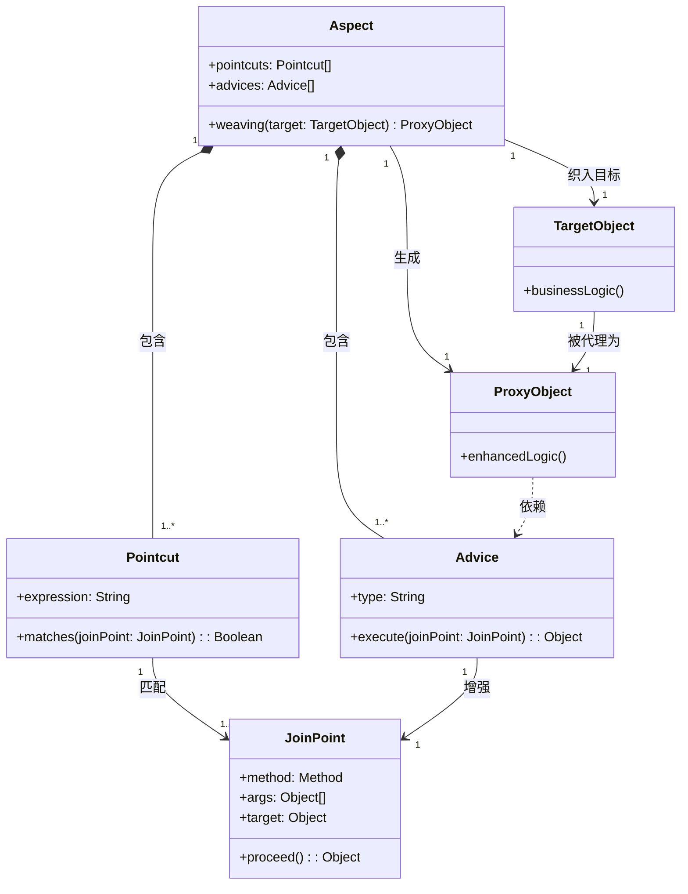
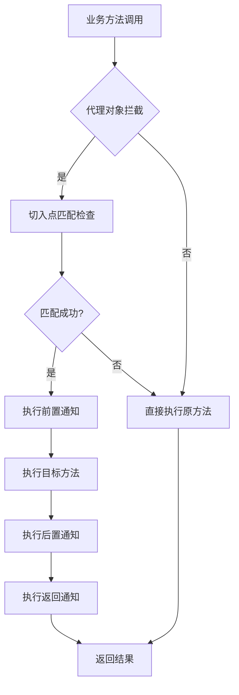

# 1.AOP概述
## 1.1.AOP概念
<font style="color:rgb(51, 51, 51);">AOP（Aspect-Oriented Programming）是面向切面编程的缩写，是一种通过预编译和运行时动态代理实现程序功能增强的编程范式。它是对OOP（面向对象编程）的重要补充，专门用于解决横切关注点（Cross-Cutting Concerns）问题。</font>

## 1.2.核心原理

<font style="color:rgb(51, 51, 51);">关键概念说明：</font>

1. <font style="color:rgb(51, 51, 51);">‌</font>**<font style="color:rgb(51, 51, 51);">切面（Aspect）</font>**<font style="color:rgb(51, 51, 51);">‌：</font>切面定义了在何时、何地、以何种方式“切入”到业务代码中。每个切面都可以包含多个切点和通知，以决定切面在应用中的行为方式。
2. <font style="color:rgb(51, 51, 51);">‌</font>**<font style="color:rgb(51, 51, 51);">切入点（Pointcut）</font>**<font style="color:rgb(51, 51, 51);">‌：通过某种方式定义需要拦截的连接点</font>
3. <font style="color:rgb(51, 51, 51);">‌</font>**<font style="color:rgb(51, 51, 51);">通知（Advice）</font>**<font style="color:rgb(51, 51, 51);">‌：在连接点执行的增强逻辑（前置/后置/返回/环绕/异常）</font>
4. <font style="color:rgb(51, 51, 51);">‌</font>**<font style="color:rgb(51, 51, 51);">连接点（JoinPoint）</font>**<font style="color:rgb(51, 51, 51);">‌：程序执行中的可拦截点（方法调用、异常处理等）</font>
5. <font style="color:rgb(51, 51, 51);">‌</font>**<font style="color:rgb(51, 51, 51);">织入（Weaving）</font>**<font style="color:rgb(51, 51, 51);">‌：将切面逻辑应用到目标对象生成代理对象的过程</font>
6. <font style="color:rgb(51, 51, 51);">‌</font>**<font style="color:rgb(51, 51, 51);">目标对象（TargetObject）</font>**<font style="color:rgb(51, 51, 51);">‌：被增强的原始业务对象</font>
7. <font style="color:rgb(51, 51, 51);">‌</font>**<font style="color:rgb(51, 51, 51);">代理对象（ProxyObject）</font>**<font style="color:rgb(51, 51, 51);">‌：增强后的生成对象</font>

<font style="color:rgb(51, 51, 51);">关系流程：</font>

<font style="color:rgb(51, 51, 51);">切面通过切入点匹配目标对象的连接点，将通知逻辑织入到这些连接点，最终生成代理对象实现功能增强。</font>

<font style="color:rgb(51, 51, 51);">代码执行流程：</font>



注意：执行流程过程中抛异常会反馈给异常通知

# 2.官方<font style="color:rgb(102, 102, 102);">Aspect方案</font>
<font style="color:rgb(102, 102, 102);">HarmonyOS主要通过插桩机制来实现切面编程，</font><font style="color:rgba(0, 0, 0, 0.9);">Aspect类用于封装提供切面能力（Aspect Oriented Programming，简写AOP）的接口，这些接口可以用来对类方法进行前后插桩或者替换实现，</font><font style="color:rgb(102, 102, 102);">包括addBefore、addAfter和replace接口。</font>

| **参数名** | **类型** | **必填** | **说明** |
| --- | --- | --- | --- |
| <font style="color:rgba(0, 0, 0, 0.9);">targetClass</font> | <font style="color:rgba(0, 0, 0, 0.9);">Object</font> | <font style="color:rgba(0, 0, 0, 0.9);">是</font> | <font style="color:rgba(0, 0, 0, 0.9);">指定的类对象或命名空间。</font> |
| <font style="color:rgba(0, 0, 0, 0.9);">methodName</font> | <font style="color:rgba(0, 0, 0, 0.9);">string</font> | <font style="color:rgba(0, 0, 0, 0.9);">是</font> | <font style="color:rgba(0, 0, 0, 0.9);">指定的方法名，不支持read-only方法。</font> |
| <font style="color:rgba(0, 0, 0, 0.9);">isStatic</font> | <font style="color:rgba(0, 0, 0, 0.9);">boolean</font> | <font style="color:rgba(0, 0, 0, 0.9);">是</font> | <font style="color:rgba(0, 0, 0, 0.9);">指定的原方法是否为静态方法，true表示静态方法，false表示实例方法。</font> |
| <font style="color:rgba(0, 0, 0, 0.9);">before/after/instead</font> | <font style="color:rgba(0, 0, 0, 0.9);">Function</font> | <font style="color:rgba(0, 0, 0, 0.9);">是</font> | <font style="color:rgba(0, 0, 0, 0.9);">要插入的函数对象。函数有参数，则第一个参数是this对象（若isStatic为true，则为类对象即targetClass；若isStatic为false，则为调用方法的实例对象），其余参数是原方法的参数。函数也可以无参数，无参时不做处理。</font> |


**<font style="color:rgba(0, 0, 0, 0.9);">缺点：</font>**

**<font style="color:rgba(0, 0, 0, 0.9);">1.不支持hook特定函数的执行</font>**

**<font style="color:rgba(0, 0, 0, 0.9);">2.不支持hook多target场景</font>**

**<font style="color:rgba(0, 0, 0, 0.9);">3.不支持hook read-only即writeable为false的target</font>**

**<font style="color:#df2a3f;">依靠经验来判断，我们的hook需求绝大部分都不支持</font>**

# 3.NovaHook方案
<font style="color:#000000;">NovaHook是Aspect的增强，真正意义上做到了随心所欲的hook！它</font>**<font style="color:#000000;">支持Aspect的所有能力，同时也解决了Aspect的</font>**<font style="color:#000000;">不支持read-only方法</font>**<font style="color:#000000;">及多target场景等问题，对顶层只开放一个函数，做到了API统一，解决了调用复杂的问题。</font>**

## **<font style="color:#000000;">3.1.专用名词说明</font>**
**<font style="color:#000000;"></font>**

| 名词 | 解释 |
| --- | --- |
| 普通hook | 即writable为true的api，可通过调用NovaHook.hook方法实现 |
| 插件hook | 必须通过hvigor插件hook的api |


## 3.2.核心技术
1. 类/对象的数据属性
2. 原型模式
3. Hvigor插件开发
4. HAP包编译构建流程
5. 正则表达式
6. 组件化

感兴趣的可自行阅读源码

注意，NovaHook与Java的动态代理不同，它是静态织入，在编译期间将切面逻辑织入到目标代码中。

## 3.3.如何集成
直接clone项目即可，Demo有测试用例。

novahook里存放hook核心能力

proxy里存放代理类

entry里的hvigorfile.ts里存放自定义插件的源码

待OpenHarmony三方库中心仓库审核通过后可通过ohpn远程集成

## **<font style="color:rgba(0, 0, 0, 0.9);">3.4.如何使用</font>**
### 3.4.1.普通hook
novahook实现了普通hook的核心能力

为方便二次开发者开发，此模块对外仅开放一个api，实现hook能力

```arkts
export class NovaHook {
  static hookMethod(options: HookOptions): void
}
```

参数说明

```arkts
/**
 * hook配置项
 */
export interface HookOptions {
  /**
   * 被hook的目标
   */
  target: any
  /**
   * 被hook的成员：方法|属性名
   */
  member: string
  /**
   * 被hook的子方法|子属性名
   * 优先级第二
   */
  childMember?: string
  /**
   * 是否hook高阶函数
   * 优先级最高
   */
  isHookHighFunction?: boolean
  /**
   * 异常通知
   */
  exceptionAdvice?: (msg: string) => void
  /**
   * 前置通知
   */
  beforeAdvice?: (context: any, ...args) => any | void
  /**
   * 环绕通知
   */
  replaceAdvice?: (context: any, origin: Function, ...args) => any
  /**
   * 后置通知
   */
  afterAdvice?: (context: any, ...args) => void
  /**
   * 返回通知
   */
  returnAdvice?: (context: any, result: any, ...args) => void
}
```

参数说明：

target、member、childMember、isHookHighFunction 构成切入点，共同确定了我们要代理哪些类型的函数

exceptionAdvice、beforeAdvice、replaceAdvice、afterAdvice、returnAdvice构成五种通知，共同确定了我们hook住源函数后要做什么增强

我们只需要这些就够了，至于织入被代理对象细节已被框架内部实现，框架使用者无需关心。

### 3.4.2.插件hook
1. 创建自定义代理类

建议将Proxy类独立成proxylib，proxylib是与hook业务相关的，代理类集中存放的地方，之所以单独抽离，一方面是为了解耦、另一方面被导包引用的地方可以做到包名一致，为代码插装提供了便利！

建议，源码级hook遵循源码名Proxy的命名规范，内部代码的成员变量及函数也与源码保持一致

2. hookPluginConfig配置文件

hookPluginConfig.txt，它是插件hook前扫包的规则限定

-hook 扫包路径

-keep 不hook的路径

-replace 要被替换的具体api，格式如下：

```arkts
^-replace\s+([^\s]+)\s+\[(import.+from.+)\]\s+([^\s]+)\s*(?:\[(.*)\])?
```

例子可参考源Demo

3. 执行编译打包assembleHap任务即可

**<font style="color:rgba(0, 0, 0, 0.9);">下面结合具体场景来说明使用步骤</font>**

# **<font style="color:rgba(0, 0, 0, 0.9);">4.NovaHook典型使用场景举例</font>**
## **<font style="color:rgba(0, 0, 0, 0.9);">4.1.hook常规api场景</font>**
1. 定义源Target

```c
// NormalApiTest.ts
/**
 * 普通api
 */
export class NormalApiTest {
  /**
   * 静态函数
   */
  static staticMethod(name: string): string {
    Logger.d(`execute static method ${name}`)
    return name
  }

  /**
   * 非静态函数
   */
  public normalMethod(name: string, age: number): string {
    Logger.d(`execute normal method name is ${name},age is ${age}`)
    return `${name}-${age}`
  }
}

```

2. hook源Target并调用源Target函数

### 4.1.1.静态函数
```arkts
// Hook.ts
export function hookStaticMethod() {
  Logger.d('=======================hook静态方法=========================')
  // 常规hook静态方法
  NovaHook.hookMethod({
    target: NormalApiTest,
    member: 'staticMethod',
    beforeAdvice: (context: any, args: any[]) => {
      Logger.d(`NormalApiTest staticMethod before, context exist: ${context != null && context != undefined},
      args is ${args.toString()}`)
    },
    replaceAdvice: (context: any, origin: Function, args: any[]) => {
      let result = origin(args[0])
      Logger.d(`NormalApiTest staticMethod replace, context exist: ${context != null &&
        context != undefined},args is ${args.toString()}`)
      return result
    },
    afterAdvice: (context: any, args: any[]) => {
      Logger.d(`NormalApiTest staticMethod after,context exist: ${context != null && context != undefined},
      args is ${args.toString()}`)
    },
    returnAdvice: (context: any, result: any, args: any[]) => {
      Logger.d(`NormalApiTest staticMethod return,context exist: ${context != null && context != undefined},
      args is ${args.toString()},result is ${result}`)
    }
  })
  NormalApiTest.staticMethod('test')
}
```

### 4.1.2.非静态函数
```arkts
// Hook.ts
export function hookCommonMethod() {
  // 常规hook非静态方法
  Logger.d('===================hook非静态方法=============================')
  NovaHook.hookMethod({
    target: NormalApiTest,
    member: 'normalMethod',
    beforeAdvice: (context: any, ...args) => {
      Logger.d(`NormalApiTest normalMethod before, context exist: ${context != null && context != undefined},
      args is ${args.toString()}`)
    },
    replaceAdvice: (context: any, origin: Function, args: any[]) => {
      let result = origin.apply(this, [...args])
      Logger.d(`NormalApiTest normalMethod replace, context exits: ${context != null &&
        context != undefined},args is ${args.toString()}`)
      return result
    },
    afterAdvice: (context: any, args: any[]) => {
      Logger.d(`NormalApiTest staticMethod after,context exist: ${context != null && context != undefined},
      args is ${args.toString()}`)
    },
    returnAdvice: (context: any, result: any, args: any[]) => {
      Logger.d(`NormalApiTest staticMethod return,context exist: ${context != null && context != undefined},
      args is ${args.toString()},result is ${result}`)
    }
  })
  new NormalApiTest().normalMethod('test', 12)
}
```

## 4.2.**<font style="color:rgba(0, 0, 0, 0.9);">hook高阶函数的执行场景</font>**
```arkts
// FunctionApiTest.ts
// 定义模拟源Target FunctionApiTest.ts
export class FunctionApiTest {
  static functionTest(func: (value1: number, value2: number) => number): number {
    Logger.d(`func 函数执行前`)
    let result = func(10, 20)
    Logger.d(`func 函数执行后`)
    return result * 10;
  }
}
// Hook.ts
// hook高阶函数
export function hookHighFunction() {
  // hook高阶函数的执行场景
  Logger.d('===================hook高阶函数的执行场景=============================')
  NovaHook.hookMethod({
    target: FunctionApiTest,
    member: 'functionTest',
    isHookHighFunction: true,
    beforeAdvice: (context: any, ...args) => {
      Logger.d(`FunctionApiTest functionTest before, context exist: ${context != null && context != undefined},
      args is ${args.toString()}`)
    },
    replaceAdvice: (context: any, origin: Function, args: any[]) => {
      let result = origin.apply(context, args)
      Logger.d(`FunctionApiTest functionTest replace, args is ${args.toString()}`)
      return result - 1
    },
    afterAdvice: (context: any, args: any[]) => {
      Logger.d(`FunctionApiTest functionTest after,context exist: ${context != null && context != undefined},
      args is ${args.toString()}`)
    },
    returnAdvice: (context: any, result: any, args: any[]) => {
      Logger.d(`FunctionApiTest functionTest return,context exist: ${context != null && context != undefined},
       args is ${args.toString()},result is ${result}`)
    }
  })
  FunctionApiTest.functionTest((value1: number, value2: number) => {
    let result = value1 + value2
    Logger.d(`FunctionApiTest original high function execute,10+20= is ${result}`)
    return result
  })
}
```

## **<font style="color:rgba(0, 0, 0, 0.9);">4.3.hook多target场景</font>**
```arkts
// 定义模拟源Target MultiTargetApiTest.ts
export class MultiTargetApiTest {
  public name: string

  constructor(builder) {
    if (arguments.length <= 0 || builder == undefined) {
      builder = new MultiTargetApiTest.Builder()
    }
    this.name = builder.name
  }

  static get Builder() { // 静态属性访问器
    class Builder {
      public name: string

      constructor() {
        this.name = ''
      }
      // 注意内部包含this对Builder自身的引用，所以，当函数调用时不能直接(),推荐apply
      build(): MultiTargetApiTest {
        return new MultiTargetApiTest(this);
      }

      setName(name): Builder {
        this.name = name
        return this
      }
    }

    return Builder
  }
}

// Hook.ts
// hook多target
export function hookMultiTarget() {
  // hook多target场景
  Logger.d('===================hook多target场景=============================')
  NovaHook.hookMethod({
    target: MultiTargetApiTest,
    member: 'Builder',
    childMember: 'build',
    beforeAdvice: (context: any, ...args) => {
      Logger.d(`MultiTargetApiTest Builder.build before, context exist: ${context != null && context != undefined},
      args exist: ${args != null && args != undefined}`)
      const builderContext = context as InstanceType<typeof MultiTargetApiTest.Builder>
      builderContext.setName('1111')
    },
    replaceAdvice: (context: any, origin: Function, args: any[]) => {
      const builderContext = context as InstanceType<typeof MultiTargetApiTest.Builder>
      Logger.d(`MultiTargetApiTest Builder.build replace, before name is ${builderContext.name}`)
      Logger.d(`MultiTargetApiTest Builder.build replace, args exist: ${args != null && args != undefined}}`)
      let result = origin.apply(context, args) as InstanceType<typeof MultiTargetApiTest>
      result.name = '22222'
      return result
    },
    afterAdvice: (context: any, args: any[]) => {
      Logger.d(`MultiTargetApiTest Builder.build after,context exist: ${context != null && context != undefined},
       args exist: ${args != null && args != undefined}`)
    },
    returnAdvice: (context: any, result: any, args: any[]) => {
      const multiTargetApiTest = result as InstanceType<typeof MultiTargetApiTest> // MultiTargetApiTest.Builder
      Logger.d(`MultiTargetApiTest Builder.build return,context exist: ${context != null && context != undefined},
       args exist: ${args != null && args != undefined},result's name is ${multiTargetApiTest.name}`)
    }
  })
  let multiTargetApiTest1 = new MultiTargetApiTest
    .Builder()
    .setName('testBuilder1')
    .build()
  Logger.d(`multiTargetApiTest name is ${multiTargetApiTest1.name}`)
  let multiTargetApiTest2 = new MultiTargetApiTest
    .Builder()
    .setName('testBuilder2')
    .build()
  Logger.d(`multiTargetApiTest name is ${multiTargetApiTest2.name}`)
}
```

## **<font style="color:rgba(0, 0, 0, 0.9);">4.4.hook仅修改源Target实际参数场景</font>**
```arkts
// ModifyParamApiTest
export class ModifyParamApiTest {

  static changedParam(param: string) {
    Logger.d(`testParam param is ${param}`)
  }
}
// Hook.ts
export function hookModifyRealParam() {
  Logger.d('===================仅修改实际参数场景=============================')
  NovaHook.hookMethod({
    target: ModifyParamApiTest,
    member: 'changedParam',
    exceptionAdvice: (msg) => {
      Logger.e(`抛异常了！${msg}`)
    },
    beforeAdvice: (context: any, args: any[]) => {
      Logger.d(`ModifyParamApiTest readOnlyTest before, context exist: ${context != null && context != undefined},
      args is ${args.toString()}`)
      return ['已被修改：hook-test']
    }
  })
  ModifyParamApiTest.changedParam('test')

}
```

## **<font style="color:rgba(0, 0, 0, 0.9);">4.5.hook函数的writeable为false的的场景</font>**
此hook方式如果采用普通hook方式会抛异常，必须要插件hook

定义源Target

```typescript

```

### 4.5.1.**<font style="color:rgba(0, 0, 0, 0.9);">普通hook</font>**
```arkts
// Hook.ts
export function hookThrowException() {
  // hook read-only的target的场景，异常通知
  Logger.d('===================hook read-only的target的场景，异常通知=============================')
  readOnlyApiTest.init()
  NovaHook.hookMethod({
    target: ReadOnlyApiTest,
    member: 'readOnlyTest2',
    exceptionAdvice: (msg) => {
      Logger.e(`抛异常了！${msg}`)
    },
    beforeAdvice: (context: any, args: any[]) => {
      Logger.d(`ReadOnlyApiTestProxy readOnlyTest2 before, context exist: ${context != null && context != undefined},
      args is ${args.toString()}`)
    },
    replaceAdvice: (context: any, origin: Function, args: any[]) => {
      let result = origin(args[0])
      Logger.d(`ReadOnlyApiTestProxy readOnlyTest2 replace, args is ${args.toString()}`)
      return result
    },
    afterAdvice: (context: any, args: any[]) => {
      Logger.d(`ReadOnlyApiTestProxy readOnlyTest2 return,context exist: ${context != null && context != undefined},
      args is ${args.toString()}`)
    },
    returnAdvice: (context: any, result: any, args: any[]) => {
      Logger.d(`ReadOnlyApiTestProxy readOnlyTest2 return,context exist: ${context != null && context != undefined},
      args is ${args.toString()},result is ${result}`)
    }
  })
  readOnlyApiTest.readOnlyTest2("test")
}
```

### **<font style="color:rgba(0, 0, 0, 0.9);">4.5.2.插件hook</font>**
1. 在proxylib里定义ReadOnlyApiTestProxy.ts

```arkts
// 1.定义ReadOnlyApiTestProxy
export class ReadOnlyApiTestProxy {

  /**
   * 读写proxy，代理只读为读写
   */
  readWriteTest(name: string) {
    hilog.debug(0, 'Aspect_Plus', `read and write method,name is ${name}`)
  }
}

export let readOnlyApiTestProxy = new ReadOnlyApiTestProxy()
```

2. hookPluginConfig.txt配置hook规则实现替换

```arkts
-hook ./src/main/ets
-keep ./src/main/ets/hook
-keep ../proxylib/src/main/ets/proxy
-replace readOnlyApiTest.readOnlyTest( [import * from "../hook/ReadOnlyApiTest"] readOnlyApiTestProxy.readWriteTest( [import { readOnlyApiTestProxy } from 'proxylib']
```

3.hook并调用源函数

```arkts
// HookReadOnlyApiTest.ts
import { readOnlyApiTest } from "../hook/ReadOnlyApiTest"

export function hookReadOnlyApi(){
  readOnlyApiTest.readOnlyTest("test")
}

// Hook.ts
export function hookReadOnlyMethod() {
  Logger.d('===================hook read-only的target的场景，代码插装=============================')
  readOnlyApiTest.init()
  hookReadOnlyApi()
}
```

## **<font style="color:rgba(0, 0, 0, 0.9);">4.6.hook 返回值类型为源码级非export修饰的类或命名空间场景</font>**
以 hook fileIo.openSync 为例

1. 在proxylib里定义FileIoProxy.ts

```arkts
import { fileIo } from "@kit.CoreFileKit"
import { Global } from "./Global";
import { FileProxy } from "./FileProxy";

/**
 * FileIo代理
 */
export class FileIoProxy {
  // .()无参数、apply正常，call只有一个参数，是把两个参数拼接起来，中间用","分隔开。
  public static openSync(...args): FileProxy {
    if (args == null || args.length < 1) {
      return
    }
    let path: string = args[0]
    let mode = null
    if (args.length == 2) {
      mode = args[1]
    }
    // let parentPath = path.slice(0, path.lastIndexOf('/'));
    let fileName = path.slice(path.lastIndexOf('/') + 1);
    // 重定向后的路径
    let ROOT_PATH = Global.getInstance().uiAbilityContext.filesDir;
    return fileIo.openSync(`${ROOT_PATH}/${fileName}`, mode)
  }
}
```

由于fileIo.openSync函数返回的File，我们业务逻辑里需要这个File，而源码层面没有暴漏给我们，所以我们无法导包使用，故参考File接口定义FileProxy接口

2. 定义FileProxy接口

```arkts
import { AsyncCallback } from "@kit.BasicServicesKit";

/**
 * File代理
 */
export interface ZFFileProxy {
  /**
   * @type { number }
   * @readonly
   * @syscap SystemCapability.FileManagement.File.FileIO
   * @since 9
   */
  /**
   * @type { number }
   * @readonly
   * @syscap SystemCapability.FileManagement.File.FileIO
   * @crossplatform
   * @since 10
   */
  /**
   * @type { number }
   * @readonly
   * @syscap SystemCapability.FileManagement.File.FileIO
   * @crossplatform
   * @atomicservice
   * @since 11
   */
  readonly fd: number;

  /**
   * File path
   *
   * @type { string }
   * @readonly
   * @throws { BusinessError } 13900005 - I/O error
   * @throws { BusinessError } 13900042 - Unknown error
   * @throws { BusinessError } 14300002 - Invalid uri
   * @syscap SystemCapability.FileManagement.File.FileIO
   * @since 10
   */
  readonly path: string;

  /**
   * File name
   *
   * @type { string }
   * @readonly
   * @throws { BusinessError } 13900005 - I/O error
   * @throws { BusinessError } 13900042 - Unknown error
   * @syscap SystemCapability.FileManagement.File.FileIO
   * @since 10
   */
  readonly name: string;

  /**
   * Get parent path of file.
   *
   * @returns { string } Return the parent path of file.
   * @throws { BusinessError } 13900005 - I/O error
   * @throws { BusinessError } 13900042 - Unknown error
   * @throws { BusinessError } 14300002 - Invalid uri
   * @syscap SystemCapability.FileManagement.File.FileIO
   * @since 11
   */
  getParent(): string;

  /**
   * Lock file with blocking method.
   *
   * @param { boolean } exclusive - whether lock is exclusive.
   * @returns { Promise<void> } The promise returned by the function.
   * @throws { BusinessError } 13900004 - Interrupted system call
   * @throws { BusinessError } 13900008 - Bad file descriptor
   * @throws { BusinessError } 13900020 - Invalid argument
   * @throws { BusinessError } 13900034 - Operation would block
   * @throws { BusinessError } 13900042 - Unknown error
   * @throws { BusinessError } 13900043 - No record locks available
   * @syscap SystemCapability.FileManagement.File.FileIO
   * @since 9
   */
  lock(exclusive?: boolean): Promise<void>;

  /**
   * Lock file with blocking method.
   *
   * @param { AsyncCallback<void> } callback - Return the callback function.
   * @throws { BusinessError } 13900004 - Interrupted system call
   * @throws { BusinessError } 13900008 - Bad file descriptor
   * @throws { BusinessError } 13900020 - Invalid argument
   * @throws { BusinessError } 13900034 - Operation would block
   * @throws { BusinessError } 13900042 - Unknown error
   * @throws { BusinessError } 13900043 - No record locks available
   * @syscap SystemCapability.FileManagement.File.FileIO
   * @since 9
   */
  lock(callback: AsyncCallback<void>): void;

  /**
   * Lock file with blocking method.
   *
   * @param { boolean } exclusive - whether lock is exclusive.
   * @param { AsyncCallback<void> } callback - Return the callback function.
   * @throws { BusinessError } 13900004 - Interrupted system call
   * @throws { BusinessError } 13900008 - Bad file descriptor
   * @throws { BusinessError } 13900020 - Invalid argument
   * @throws { BusinessError } 13900034 - Operation would block
   * @throws { BusinessError } 13900042 - Unknown error
   * @throws { BusinessError } 13900043 - No record locks available
   * @syscap SystemCapability.FileManagement.File.FileIO
   * @since 9
   */
  lock(exclusive: boolean, callback: AsyncCallback<void>): void;

  /**
   * Try to lock file with returning results immediately.
   *
   * @param { boolean } exclusive - whether lock is exclusive.
   * @throws { BusinessError } 13900004 - Interrupted system call
   * @throws { BusinessError } 13900008 - Bad file descriptor
   * @throws { BusinessError } 13900020 - Invalid argument
   * @throws { BusinessError } 13900034 - Operation would block
   * @throws { BusinessError } 13900042 - Unknown error
   * @throws { BusinessError } 13900043 - No record locks available
   * @syscap SystemCapability.FileManagement.File.FileIO
   * @since 9
   */
  tryLock(exclusive?: boolean): void;

  /**
   * Unlock file.
   *
   * @throws { BusinessError } 13900004 - Interrupted system call
   * @throws { BusinessError } 13900008 - Bad file descriptor
   * @throws { BusinessError } 13900020 - Invalid argument
   * @throws { BusinessError } 13900034 - Operation would block
   * @throws { BusinessError } 13900042 - Unknown error
   * @throws { BusinessError } 13900043 - No record locks available
   * @syscap SystemCapability.FileManagement.File.FileIO
   * @since 9
   */
  unlock(): void;
}
```

3. HookPluginConfig.txt配置hook规则实现替换

```arkts
-replace fileIo.openSync( [import * from "@ohos.file.fs"] FileIoProxy.openSync( [import { FileIoProxy } from 'proxylib']
```

4. hook及调用

```arkts
// HookFileApi.ts
import fileIo from "@ohos.file.fs";
import { Global } from "proxylib";
import Logger from "aoplib/src/main/com/wp/aop/utils/Logger";


export function testFile() {
  let path = Global.getInstance().uiAbilityContext.cacheDir + '/test.txt'
  Logger.d(`文件源路径：${path}`)
  let file = fileIo.openSync(path, fileIo.OpenMode.CREATE | fileIo.OpenMode.WRITE_ONLY)
  fileIo.writeSync(file.fd, '写入的测试文本a')
  fileIo.closeSync(file.fd)
  Logger.d(`文件路径重定向至：${file.path}`)
  Logger.d('文本写入成功！')
}

// 模拟以下自定义的openSync不会被hook

// export function testFile(path: string) {
//   fileIo.openSync(path, fileIo.OpenMode.CREATE | fileIo.OpenMode.WRITE_ONLY)
// }

// class fileIo {
//   static openSync(path: string, mode?: number) {
//     let str:string='skdfroms';
//     str.split('from')[1].trim()
//     // Logger.d(`path`)
//   }
// }
// Hook.ts
export function hookReturnValueNotExport() {
  Logger.d('===================返回值类型为源码级非export修饰的类或命名空间场景，代码插装=============================')
  testFile()
}
```

# 5.参考资料
1. 《JavaScript高级程序编程设计》
2. [AspectPro框架](https://github.com/HuolalaTech/AspectPro)
3. [鸿蒙官方开发文档](https://developer.huawei.com/consumer/cn/doc/harmonyos-references-V14/js-apis-util-V14#aspect11)